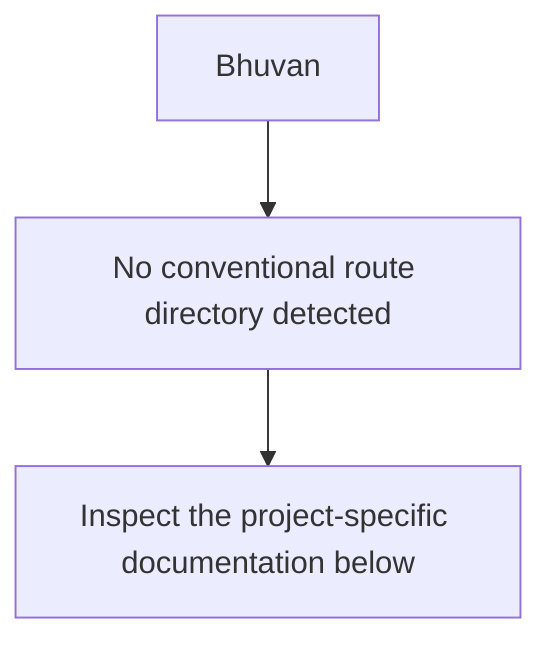
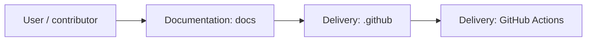
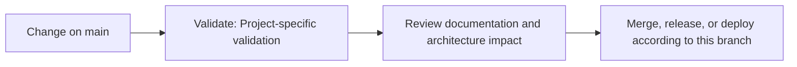

<div align="center">

# Bhuvan

<!-- interactive-readme-standard:start -->

> [!NOTE]
> **Branch-specific documentation:** this section is maintained for [`main`](https://github.com/Nischhalsubba/Bhuvan/tree/main). It is generated from the files present on this branch and preserves the project-authored README below.

<details open>
<summary><strong>Interactive repository guide</strong></summary>

## Branch overview

| Item | Value |
|---|---|
| Repository | [`Nischhalsubba/Bhuvan`](https://github.com/Nischhalsubba/Bhuvan) |
| Branch | [`main`](https://github.com/Nischhalsubba/Bhuvan/tree/main) |
| Detected stack | PHP, HTML, CSS, JavaScript |
| Detected manifests | No standard manifest detected |
| Documentation policy | Every maintained branch must explain purpose, setup, structure, architecture, flows, testing, delivery, security, and ownership. |

## Repository structure

```mermaid
flowchart TD
    ROOT["Bhuvan / main"]
    ROOT --> P0[".github/"]
    ROOT --> P1[".vscode/"]
    ROOT --> P2["css/"]
    ROOT --> P3["docs/"]
    ROOT --> P4["images/"]
    ROOT --> P5["js/"]
    ROOT --> P6["AGENTS.md"]
    ROOT --> P7["backup.txt"]
    ROOT --> P8["contact.html"]
    ROOT --> P9["export.html"]
    ROOT --> P10["footer.php"]
    ROOT --> P11["header.php"]
    ROOT --> P12["import.html"]
    ROOT --> P13["import.php"]
    ROOT --> P14["index.html"]
    ROOT --> P15["index.php"]
    ROOT --> P16["LICENSE"]
    ROOT --> P17["nav.php"]
```



The diagram is generated from the branch's actual top-level files and directories. Use the branch link above for complete source navigation.

## Website or application structure



## Application and responsibility flow



## Change-to-delivery flow



## README requirements for this branch

- Explain what this branch contains and how it differs from the default branch.
- Keep installation, configuration, usage, testing, deployment, security, support, and license information accurate.
- Document repository, website or application, API, data, authentication, background-job, and deployment flows when they exist.
- Prefer Mermaid diagrams and expandable `<details>` sections for visual navigation.
- Link diagrams and modules to real source paths; never invent missing components.
- Preserve project-specific documentation and update diagrams whenever architecture or major paths change.
- Treat secrets, private infrastructure, customer data, and credentials as prohibited README content.

</details>

<!-- interactive-readme-standard:end -->

### Static Portfolio / Brand Website

**A lightweight static website repository for a project or brand called Bhuvan, intended for presenting a hero section, portfolio/gallery content, contact details, and a clean frontend structure.**


</div>

---

## ✨ Overview

**Bhuvan** is a static website project intended to present a personal, brand, or portfolio-style web presence. The repository is lightweight and can be adapted for a small business, personal profile, creative work showcase, or project landing page.

The current documentation is written to make the repo easier to understand, customize, and deploy.

---

## 🧭 Table of Contents

- [Project Purpose](#-project-purpose)
- [Designer’s Perspective](#-designers-perspective)
- [Suggested Sections](#-suggested-sections)
- [Tech Stack](#-tech-stack)
- [Run Locally](#-run-locally)
- [Deployment](#-deployment)
- [Quality Checklist](#-quality-checklist)
- [Roadmap](#-roadmap)
- [License](#-license)

---

## 🎯 Project Purpose

This repository can be used to build a simple static website that introduces a person, project, or brand.

Possible goals:

- present a clear hero introduction
- showcase work or imagery
- provide contact information
- create a simple online identity
- deploy a lightweight static site quickly

---

## 🎨 Designer’s Perspective

A small portfolio or brand website should be simple, clear, and visually intentional.

The strongest UX priorities are:

- clear first impression
- readable content
- strong visual hierarchy
- mobile-friendly layout
- easy contact path
- consistent spacing and typography

---

## 🧱 Suggested Sections

| Section | Purpose |
|---|---|
| Hero | Introduce the person, project, or brand |
| About | Explain background and purpose |
| Gallery / Portfolio | Showcase images or selected work |
| Services / Highlights | Present what is offered or featured |
| Contact | Help visitors reach out |
| Footer | Social links, copyright, and secondary links |

---

## 🛠 Tech Stack

| Layer | Technology |
|---|---|
| Markup | HTML |
| Styling | CSS |
| Interactions | JavaScript |

---

## 🚀 Run Locally

Open the main HTML file directly in a browser, or run a static server:

```bash
python -m http.server 8000
```

Then open:

```text
http://127.0.0.1:8000/
```

---

## 🌐 Deployment

This project can be deployed to:

- GitHub Pages
- Netlify
- Vercel
- Cloudflare Pages
- shared hosting

---

## ✅ Quality Checklist

- [ ] Replace placeholder text.
- [ ] Replace placeholder images.
- [ ] Add favicon.
- [ ] Add SEO title and description.
- [ ] Add Open Graph image.
- [ ] Test mobile responsiveness.
- [ ] Check all links.
- [ ] Add accessible alt text.

---

## 🗺 Roadmap

- Add screenshots to this README.
- Add live demo link.
- Improve section documentation.
- Add contact form validation.
- Add deployment instructions with screenshots.

---

## 📜 License

This project is licensed under the **MIT License**.

---

<div align="center">

A simple static website base for presenting a brand, project, or portfolio clearly.

</div>
