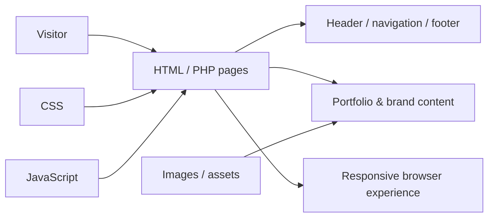
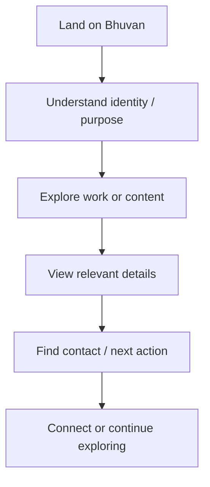
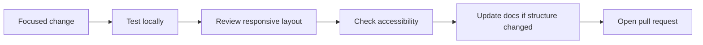

<div align="center">

# Bhuvan

**A lightweight portfolio and brand website for presenting identity, visual work, content, and contact information through a clear responsive experience.**


[Browse website](./site) · [Technical README](./site/README.md) · [Issues](https://github.com/Nischhalsubba/Bhuvan/issues)

</div>

## Overview

**Bhuvan** is a portfolio / brand website implemented with PHP, HTML, CSS, and JavaScript. The maintained website lives under `site/` and includes page content, shared PHP sections, styling, scripts, imagery, and project documentation.

| Audience | What matters most |
|---|---|
| Visitors | Clear identity, work, content, and contact paths |
| Developers | PHP/HTML structure, reusable layout pieces, CSS and JavaScript |
| Designers | Hierarchy, typography, imagery, responsive behavior and states |
| Content owners | Accurate copy, portfolio material, metadata and contact details |

<details open>
<summary><strong>🏗️ Interactive website architecture</strong></summary>



</details>

## Visitor flow



## Repository map

```text
Bhuvan/
├── .github/     # repository automation
├── site/        # maintained website
└── README.md    # project front door
```

See [`site/README.md`](./site/README.md) for the deeper branch-aware technical guide.

## Getting started

```bash
git clone https://github.com/Nischhalsubba/Bhuvan.git
cd Bhuvan/site
```

The website contains static HTML alongside PHP entry points. Use a PHP-capable local server when testing PHP behavior; static pages can also be reviewed directly or through a simple HTTP server.

## Design & accessibility

Prioritize a clear first impression, consistent spacing and typography, useful image alternatives, responsive layouts, keyboard-visible focus, readable contrast, and an obvious contact path. Changes should preserve the relationship between shared navigation, page content, and visual hierarchy.

## SEO & discoverability

Public pages should use a unique title and description, one clear primary heading, semantic sections, descriptive links, meaningful image alt text, canonical URLs where appropriate, and Open Graph/social metadata. Keep project, portfolio, brand, and page-specific terms in natural readable copy rather than repeating them mechanically.

## Contribution flow


