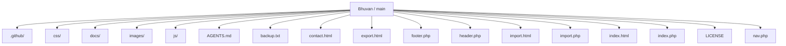
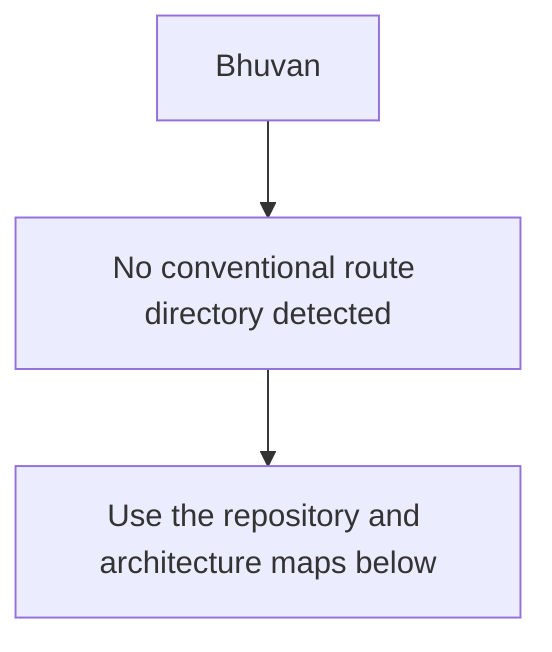
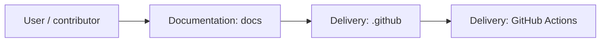
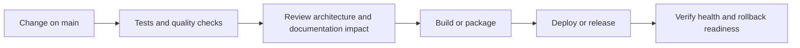
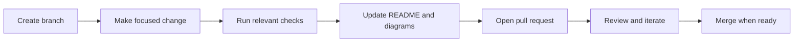

<!-- interactive-readme-standard:start -->

<div align="center">

# Bhuvan

**Branch-aware technical guide for [`main`](https://github.com/Nischhalsubba/Bhuvan/tree/main)**

<p>      </p>

<p>
  <a href="https://github.com/Nischhalsubba/Bhuvan/tree/main"><strong>Browse source</strong></a> ·
  <a href="https://github.com/Nischhalsubba/Bhuvan/issues"><strong>Issues</strong></a> ·
  <a href="https://github.com/Nischhalsubba/Bhuvan/codespaces/new?ref=main"><strong>Open in Codespaces</strong></a>
</p>

</div>

> [!IMPORTANT]
> This guide is generated from the files actually present on `main`. It links to detected source paths, preserves project-authored notes, and avoids claiming components that were not found.

## At a glance

| Item | Detected value |
|---|---|
| Purpose | A PHP project documented from the current branch structure and manifests. |
| Branch role | Default branch |
| Stack | PHP, HTML, CSS, JavaScript |
| Manifests | No standard manifest detected |
| Prerequisites | Confirm from the detected manifests |
| Delivery | GitHub Actions |
| License | LICENSE |

## Branch scope

This is the repository's default branch.


## Quick start

> No reliable setup command was detected. Use the preserved project-authored notes and manifests rather than guessing.

### Configuration surface

- No committed environment example file was detected.

> Never commit secrets, private keys, production credentials, customer data, or unredacted infrastructure details.

## Repository map



| Responsibility | Detected source paths |
|---|---|
| Documentation | [`docs`](https://github.com/Nischhalsubba/Bhuvan/tree/main/docs) |
| Delivery | [`.github`](https://github.com/Nischhalsubba/Bhuvan/tree/main/.github) |

## Website or application map



## Architecture and responsibility flow




## Quality, security, and operations

<table>
<tr>
<td width="33%" valign="top">

### Quality

- No conventional test directory was detected automatically.

Detected commands:
- No standard quality command detected.

</td>
<td width="33%" valign="top">

### Security

- No dedicated security policy or automated dependency configuration was detected.

Review authentication, authorization, input validation, dependency updates, secret handling, and failure recovery before release.

</td>
<td width="34%" valign="top">

### Observability

- No dedicated observability integration was detected automatically.

Define useful logs, metrics, traces, alerts, and rollback signals for production-facing branches.

</td>
</tr>
</table>

## Delivery flow



### Automation detected

- [`.github/workflows/apply-interactive-readme.yml`](https://github.com/Nischhalsubba/Bhuvan/blob/main/.github/workflows/apply-interactive-readme.yml)

## Contribution flow



- Keep changes focused and explain architectural consequences.
- Run the checks relevant to the changed area.
- Update diagrams whenever routes, modules, data models, authentication, jobs, or delivery paths change.
- Add screenshots or recordings for visual behavior changes when useful.
- Use issues for reproducible defects and pull requests for reviewable changes.

## Ownership and support

| Topic | Source |
|---|---|
| Repository | [`Nischhalsubba/Bhuvan`](https://github.com/Nischhalsubba/Bhuvan) |
| Branch | [`main`](https://github.com/Nischhalsubba/Bhuvan/tree/main) |
| Ownership | No CODEOWNERS file detected |
| Contributing | Use the contribution flow above |
| Support | [Open or review issues](https://github.com/Nischhalsubba/Bhuvan/issues) |
| License | [`LICENSE`](https://github.com/Nischhalsubba/Bhuvan/blob/main/LICENSE) |

<details>
<summary><strong>Documentation maintenance checklist</strong></summary>

- [ ] Purpose and branch scope are accurate.
- [ ] Setup and configuration commands still work.
- [ ] Repository, application, API, data, authentication, job, and deployment diagrams match the code.
- [ ] Tests, security controls, observability, and rollback behavior are documented.
- [ ] Links point to real files on this branch.
- [ ] No secrets or private operational details are exposed.

</details>

<!-- interactive-readme-standard:end -->

<!-- project-authored-notes:start -->
<details>
<summary><strong>Project-authored notes preserved from this branch</strong></summary>

<div align="center">

# Bhuvan

### Static Portfolio / Brand Website

**A lightweight static website repository for a project or brand called Bhuvan, intended for presenting a hero section, portfolio/gallery content, contact details, and a clean frontend structure.**


</div>

---

## ✨ Overview

**Bhuvan** is a static website project intended to present a personal, brand, or portfolio-style web presence. The repository is lightweight and can be adapted for a small business, personal profile, creative work showcase, or project landing page.

The current documentation is written to make the repo easier to understand, customize, and deploy.

---

## 🧭 Table of Contents

- [Project Purpose](#-project-purpose)
- [Designer’s Perspective](#-designers-perspective)
- [Suggested Sections](#-suggested-sections)
- [Tech Stack](#-tech-stack)
- [Run Locally](#-run-locally)
- [Deployment](#-deployment)
- [Quality Checklist](#-quality-checklist)
- [Roadmap](#-roadmap)
- [License](#-license)

---

## 🎯 Project Purpose

This repository can be used to build a simple static website that introduces a person, project, or brand.

Possible goals:

- present a clear hero introduction
- showcase work or imagery
- provide contact information
- create a simple online identity
- deploy a lightweight static site quickly

---

## 🎨 Designer’s Perspective

A small portfolio or brand website should be simple, clear, and visually intentional.

The strongest UX priorities are:

- clear first impression
- readable content
- strong visual hierarchy
- mobile-friendly layout
- easy contact path
- consistent spacing and typography

---

## 🧱 Suggested Sections

| Section | Purpose |
|---|---|
| Hero | Introduce the person, project, or brand |
| About | Explain background and purpose |
| Gallery / Portfolio | Showcase images or selected work |
| Services / Highlights | Present what is offered or featured |
| Contact | Help visitors reach out |
| Footer | Social links, copyright, and secondary links |

---

## 🛠 Tech Stack

| Layer | Technology |
|---|---|
| Markup | HTML |
| Styling | CSS |
| Interactions | JavaScript |

---

## 🚀 Run Locally

Open the main HTML file directly in a browser, or run a static server:

```bash
python -m http.server 8000
```

Then open:

```text
http://127.0.0.1:8000/
```

---

## 🌐 Deployment

This project can be deployed to:

- GitHub Pages
- Netlify
- Vercel
- Cloudflare Pages
- shared hosting

---

## ✅ Quality Checklist

- [ ] Replace placeholder text.
- [ ] Replace placeholder images.
- [ ] Add favicon.
- [ ] Add SEO title and description.
- [ ] Add Open Graph image.
- [ ] Test mobile responsiveness.
- [ ] Check all links.
- [ ] Add accessible alt text.

---

## 🗺 Roadmap

- Add screenshots to this README.
- Add live demo link.
- Improve section documentation.
- Add contact form validation.
- Add deployment instructions with screenshots.

---

## 📜 License

This project is licensed under the **MIT License**.

---

<div align="center">

A simple static website base for presenting a brand, project, or portfolio clearly.

</div>

</details>
<!-- project-authored-notes:end -->
