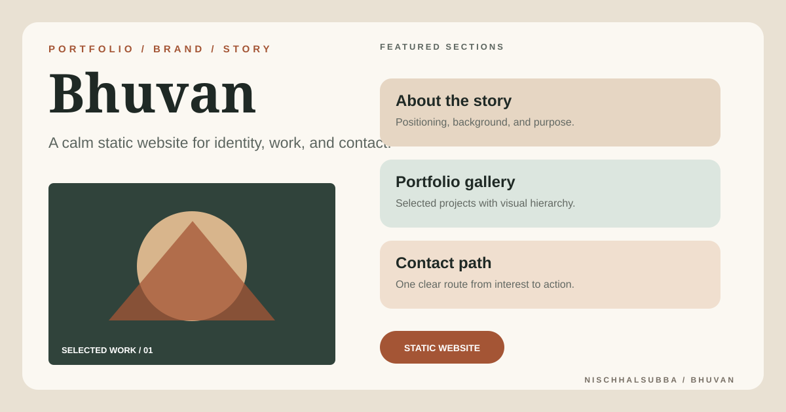

# Bhuvan Repository Overview

## Classification

- Static portfolio or brand website
- HTML, CSS, and JavaScript
- No framework build required
- Public deployment not verified during this pass
- Fresh browser screenshot not captured because public hosts were unreachable
- Thumbnail is a designed presentation asset, not a runtime screenshot

## Verification priorities

1. Identify the actual entry HTML file and confirm every asset path.
2. Replace placeholder copy and images.
3. Test navigation, gallery, and contact interactions.
4. Add page metadata, Open Graph information, and a favicon.
5. Review mobile layout, keyboard access, contrast, and image alt text.

Repository maintenance rules are documented in `../AGENTS.md`.